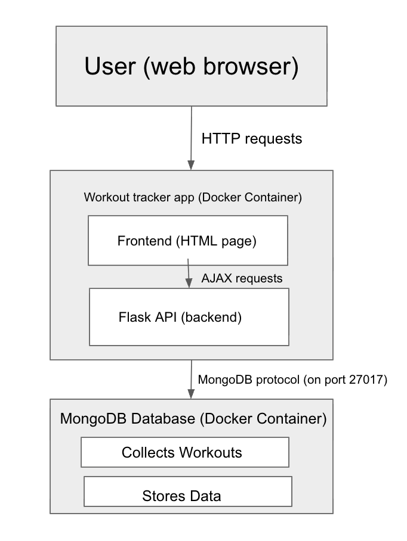
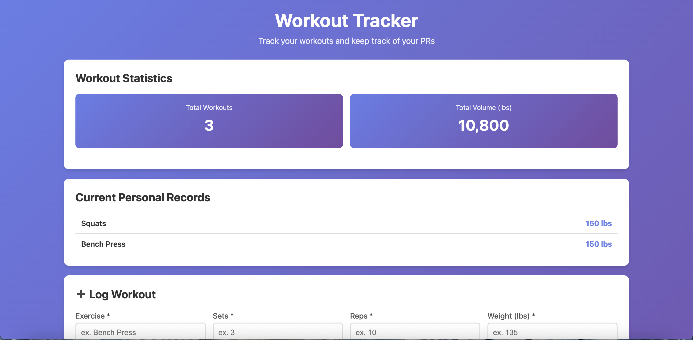
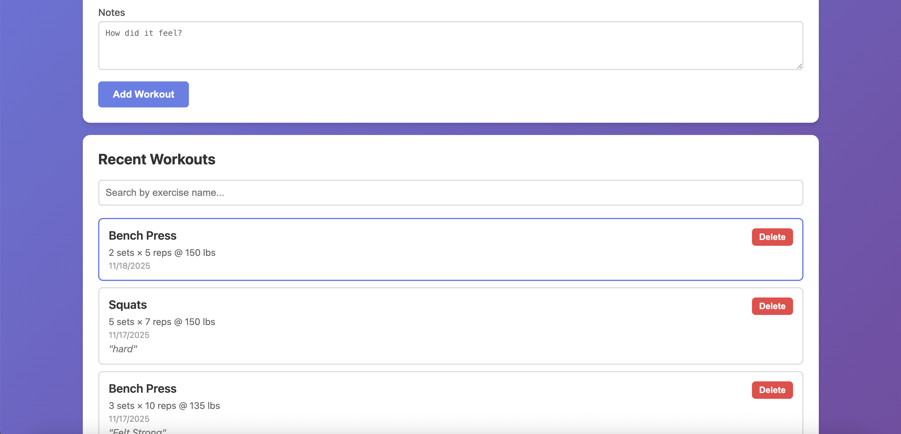

## Executive Summary:

This webpage provides a simple, easy-to-understand place for gym-goers to track their workout progress and see how far they’ve come. Some people struggle to remember past workouts and feel lost when they’ve been working out consistently but don’t see any major gains or improvements.

Using this webpage solves both of these problems, as it allows the user to input details from their workout, including the exercise they performed, the number of sets and reps per set, the weight used, and any comments about how it went. The webpage keeps a running list of recent workouts, where you can view all the details inputted, as well as search that list to find workouts only for a specific exercise. It also shows a running total of the pounds lifted and the number of workouts, along with current PRs for each exercise. This gives a nice space where users can see both their progress through their PRs and see the total amount they've worked out since using the app. 

## System Overview:

The main concept I used in this project was MongoDB along with Flask API.

### Architecture Diagram: 

The data is all generated by the user so the size varies with how much data is inputted. The format is JSON and there's no associated licenses. There are no models associated with this project. It does use MongoDB as a service with the source being the docker container. The format is also JSON and MongoDB uses Server Side Public License (SSPL) v1.0.

Complete list of licenses and sources: 

- Flask - BSD-3-Clause License
  - Copyright © 2010 Pallets
  - https://flask.palletsprojects.com/

- MongoDB - Server Side Public License (SSPL)
  - Copyright © MongoDB, Inc.
  - https://www.mongodb.com/

- PyMongo - Apache License 2.0
  - Copyright © MongoDB, Inc.
  - https://pymongo.readthedocs.io/

- Docker - Apache License 2.0
  - Copyright © Docker, Inc.
  - https://www.docker.com/
 
- Claude for helping to write code and provide templates for index.html

### License

This project is licensed under the MIT License - see the [LICENSE](LICENSE) file for details.
## How to Run (Local): 

One command to build and run the app is: 

docker-compose up --build 

You can also check the health of the webpage with: 

curl http://localhost:8080/health

## Design Decisions: 

Knowing that I wanted to create a webpage that stores information and extracts certain elements of it, MongoDB made the most sense for this project. With MongoDB, I can store all the information inputted by the user in JSON objects and then use queries to find specific entries, which helps the user search for workouts that include a particular exercise and perform calculations for PRs. The main alternative to using MongoDB for this project would have been PostgreSQL. With PostgreSQL, I could still use JSON and JSON queries; however, the database is SQL-based, which I have less experience with. One of the biggest reasons to choose MongoDB over PostgreSQL is the flexibility that MongoDB offers. If I had used PostgreSQL, the data would be stored essentially in a table, which means that there would be no opportunity to make changes in the future where different data from the workouts is inputted without making major changes in how the data is stored. MongoDB, on the other hand, stores the data as a JSON object and can have different information in each object. This means that if I wanted to update the tracker to include cardio workouts, for instance, tracking the time and type of cardio could be stored in the same place as the current data. 

Another option for this project was to use pandas data frames to store and analyze the data, but data frames are also less flexible than MongoDB. I’m more comfortable with pandas, so that would make the app easier to troubleshoot, but overall, there are too many drawbacks to using it. One of these drawbacks is that the data will be stored in a csv file instead of a database, and to access any of the workouts or workout statistics, the entire csv file needs to be loaded into the dataframe. This isn’t detrimental at first, but when more data is inputted (which is the goal of using the website), the csv file will become very large, so it will take much longer to load the entire thing and calculate the statistics. It could even crash your machine if the dataset becomes too large, since every workout is being loaded into the memory.

This project has some advantages, including being low-cost and low complexity, meaning that the app is fairly easy for anyone to create and is very accessible to run, since you can run it locally for free and only need access to the terminal on your computer. It is also not very complex, meaning that it’s easy to debug; however, it might not be able to handle larger amounts of data and have multiple people contributing to it. It also recalibrates the PRs and workout statistics every time a new workout is inputted, which means that it will get slower the more data it stores. Currently, it does what it’s supposed to, meaning that it is high-performance based on the goals, but other ways of building it could be better later on when more features are added and there needs to be a more complex backend. Similarly, the app is maintainable right now due to the simplicity, but would likely have to be reworked if more complex features are added and you want to have multiple people working on the website. 

At the moment, the webpage has basic security, making it good for personal use, but not for holding sensitive data. For secrets management, the app uses environment variables, which ensures that any logins or personal information that are used to connect to the database will not be committed to GitHub. On this note, the .env.example file allows anyone trying to recreate the project to know what environment variables are needed and what their values should look like without giving away any secrets like login information. The user inputs are validated, but only to make sure that the required fields have a value, and it ensures that certain fields have valid inputs by converting the string inputted in the sets and reps fields to an integer and converting the string in the weight field to a float. If the entered values can’t be converted, the code won’t be able to execute properly. Other than meeting these criteria, the user can input anything into the fields, meaning that the app will accept unreasonable entries. Also, the app doesn’t have any PII handling because it doesn’t collect any personally identifiable information. Since the page only collects information about the workout and has no way to tie it back to the user, there is no need to worry about protecting their information. 

Both my logs and metrics are quite basic. For the logs, you can see them for the container that is running, but once the container stops, the logs for that session are lost. They also contain no additional information other than the get, post, and delete requests for getting information about the workouts, creating a new workout, and deleting the workouts, respectively. This means that there is no way for the developer to differentiate the logs by user and analyze what they’re doing. This isn’t a problem when the webpage is only being used by one person, but it could become an issue if it has multiple users. There are also no metrics other than api/health, meaning that the developer doesn’t know any information other than if the page is responding. If the page was being used for anything other than personal use, this could become a problem, as the only way to find issues with the webpage is for users to complain. If we wanted the webpage to get enough users that the machine needed to be scaled, we would want to use vertical scaling, as a bigger machine would be able to handle more requests and store more data without changing how the app runs. One of the biggest limitations of the app is that it has no caching, meaning that the stats like current PRs and total load are recalculated every time a new workout is inputted. This means that when there is a large number of workouts being saved in the app, it will likely take a while to calculate the statistics, as the machine would have to sort through all of those workouts to find which ones have the highest weight and so on. This takes much more time than having the machine simply compare the new workout to the existing PRs to see if it’s a new PR.  Another limitation is that the app has no automated testing, meaning that even though there is code that can be run to test the page, this has to be manually run, so in practice, the most likely way to find an issue with the webpage is to notice it when trying to use the app. 

## Results & Evaluation:

### Sample output: 

tests/test_app.py tests the code to make sure that the endpoint is healthy, a new workout can be created, and all the stored workouts can be fetched. The output of running pytests is: 

3 passed in 0.18s 

For validations, app.py ensures that any data inputted by the user has values for exercise, sets, reps, and weight. It also makes sure that the values for sets and reps can be changed to an integer and that the value for weight can be changed to a float. Since these validations are written into app.py, it won't execute if they aren't met and the user will get an error. 

## What’s Next: 

Something that would be a good next step for improving the app is to have it handle other types of workouts that require different kinds of data than it currently accepts. As of right now, the webpage only works well for tracking weightlifting workouts, as it needs the user to input the exercise, number of sets, number of reps, and weight. Other workouts, like running, don’t give this kind of information, so they’d be impossible to track with the website. Adding more fields for information, including the time elapsed during the workout, distance, and pace, would allow cardio workouts to also be tracked. Having new types of workouts allowed would also mean that new statistics should be calculated, such as total time spent doing cardio and distance moved, combining the distance of running, walking, swimming, and more. Another improvement would be to allow the user to input multiple exercises in one workout session. Currently, you can only input information for one exercise at a time, but most people will do multiple exercises during one workout. If you put each exercise into the tracker, it will count them as different workouts, skewing the number of total workouts. Allowing the option to input multiple exercises into one workout will provide a more accurate representation of the user’s workout.

One refactor would be to move some of the operations that app.py does into other files. Currently, app.py not only has the routes for the Flask app but also connects to the database and calculates the current PRs, total volume, and total workouts. If I separated everything other than the Flask app into separate directories and files, then the app as a whole would be easier to read, as each feature would be isolated. This would make it clearer what each file was doing and which lines of code were associated with each feature. It would also make debugging the app easier because now the app can’t run if there is an error in any part of app.py. However, if the more complex parts were in separate files, it would be clear where the issue lies and therefore which part of the code needs to be fixed. This wouldn’t change the frontend of the application at all, but would make it easier for others to work on it and make improvements.

A stretch feature is to include user authentication so multiple people can input their workouts and keep them separate. Currently, the app displays all workouts added, allowing multiple users with the link to the webpage to view workouts created by others, which defeats the purpose of the app. Having multiple people’s data skews the statistics, meaning that it no longer accurately tracks progress, which is an issue. If I added a login feature where once the person created an account, an ID is created and associated with all of the workouts they input as a new field in the JSON object, and only objects with that ID are fetched and included in the calculations shown on the frontend, this problem would be solved. 

## Links: 
GitHub Repo: https://github.com/maya-clifford/final-case

Public Cloud App: https://workout-tracker-q0i7.onrender.com/

To get the Cloud App to load the workouts, you need to run docker-compose up. 
